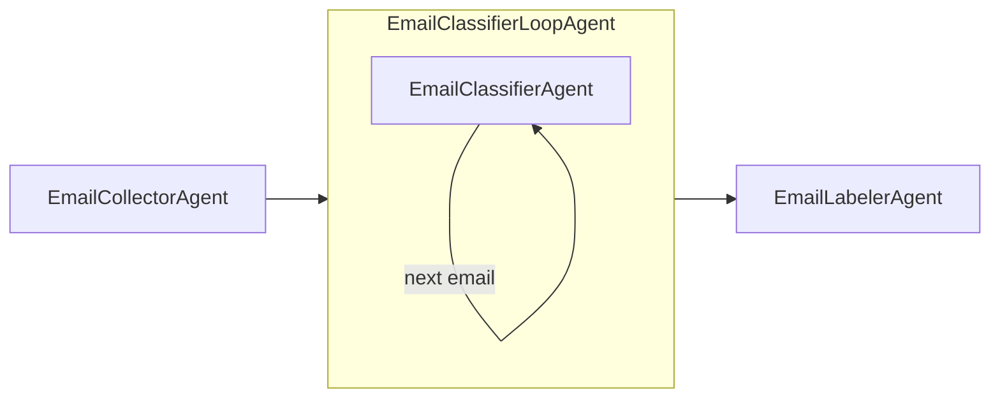

# Email Janitor

Agentic solution that cleans up your email inbox.

## Description

Email Janitor is an agentic pipeline that collects unread emails from your Gmail inbox, classifies each message (ACTIONABLE, INFORMATIONAL, PROMOTIONAL, or NOISE) using an LLM classifier, then applies Gmail labels and archives messages accordingly. Processed messages are tagged with `janitor/done` so they are skipped on subsequent runs.

The app runs in a loop (e.g. every 10 seconds), processing new unread mail each cycle. It uses [Google ADK](https://github.com/google/adk) with [LiteLLM](https://docs.litellm.ai/) (Ollama by default) for local, privacy-preserving classification.

## Features

- **Gmail inbox collection** — Unread messages from inbox only; excludes sent mail and already-processed messages.
- **LLM classification** — Per-email classification using a configurable LiteLLM-backed model.
- **Configurable thresholds** — Confidence threshold and model via environment variables.
- **Nested Gmail labels** — Applies `janitor/*` category labels and archives non-actionable mail.
- **Run auditing** — SQLite database records every run and per-email classification for review.
- **Docker / Docker Compose** — Run via Compose with mounted Gmail credentials and a persistent data volume.

## Prerequisites

- **Python** ≥ 3.12
- **Ollama** with `llama3.1:8b` pulled, or another [LiteLLM](https://docs.litellm.ai/)-compatible provider
- **Gmail API** — OAuth client credentials (`client_secret.json` and `gmail_token.json`) via the [simplegmail](https://github.com/jeremyephron/simplegmail) OAuth flow
- **Environment** — `.env` supported via `python-dotenv` (see [Configuration](#configuration))

## Installation

Clone the repository, then install dependencies with [uv](https://docs.astral.sh/uv/):

```bash
make install
# or: uv sync --group dev
```

## Configuration

All configuration is optional — defaults are production-ready for Ollama.

### Gmail credentials

Place `client_secret.json` and `gmail_token.json` in the project root. For Docker, they are mounted into the container (see [compose.yml](compose.yml)).

Run the auth flow once to generate `gmail_token.json`:

```bash
make auth
```

### Environment variables

Copy `.env.example` to `.env` and adjust as needed.

#### App (`EMAIL_JANITOR_` prefix)

| Variable                    | Description                            | Default              |
| --------------------------- | -------------------------------------- | -------------------- |
| `EMAIL_JANITOR_POLL_INTERVAL` | Seconds between processing runs      | `10`                 |
| `EMAIL_JANITOR_USER_ID`     | User ID for ADK session management     | `email-janitor-user` |
| `EMAIL_JANITOR_APP_NAME`    | Application name passed to ADK runner (must be a valid identifier)  | `EmailJanitor`      |

#### Classifier (`EMAIL_CLASSIFIER_` prefix)

| Variable                              | Description                                         | Default                    |
| ------------------------------------- | --------------------------------------------------- | -------------------------- |
| `EMAIL_CLASSIFIER_MODEL`              | LiteLLM model ID                                    | `ollama_chat/llama3.1:8b`  |
| `EMAIL_CLASSIFIER_CONFIDENCE_THRESHOLD` | Minimum confidence to accept a classification (1–5) | `4.0`                    |

#### Gmail (`GMAIL_` prefix)

| Variable                    | Description                                    | Default                |
| --------------------------- | ---------------------------------------------- | ---------------------- |
| `GMAIL_PROCESSED_LABEL`     | Label applied to every processed email         | `janitor/done`         |
| `GMAIL_NOISE_LABEL`         | Label applied to NOISE emails                  | `janitor/noise`        |
| `GMAIL_PROMOTIONAL_LABEL`   | Label applied to PROMOTIONAL emails            | `janitor/promotions`   |
| `GMAIL_INFORMATIONAL_LABEL` | Label applied to INFORMATIONAL emails          | `janitor/newsletters`  |
| `GMAIL_INBOX_QUERY`         | Base Gmail search query for fetching emails    | `in:inbox -in:sent`    |

Labels are created automatically if they don't exist. The `janitor/*` hierarchy appears as a collapsible `janitor` parent in the Gmail sidebar.

#### Database (`DATABASE_` prefix)

| Variable        | Description                  | Default              |
| --------------- | ---------------------------- | -------------------- |
| `DATABASE_PATH` | Path to the SQLite database file | `email_janitor.db` |

In Docker, this is set to `/data/email_janitor.db` and backed by a named volume (see [compose.yml](compose.yml)).

## Usage

### Local

```bash
make run
# or: uv run email-janitor
```

The agent runs in a loop (default 10 seconds between runs). Press `Ctrl+C` to stop.

### Docker

Build and run with Docker Compose:

```bash
docker compose up
```

Or build the image directly:

```bash
make docker-build                                        # image=email-janitor:latest
make docker-build IMAGE=ghcr.io/you/email-janitor TAG=1.0.0
```

Push to a registry:

```bash
make docker-push IMAGE=ghcr.io/you/email-janitor TAG=1.0.0
```

## Architecture

The root agent is a **SequentialAgent** pipeline:

1. **EmailCollectorAgent** — Fetches unread emails from Gmail (inbox, excluding sent and already processed). Stores results in session state and agent state.
2. **EmailClassifierLoopAgent** — A `LoopAgent` that classifies emails one-by-one. On each iteration, `EmailClassifierAgent`:
   - Checks whether all emails have been classified; escalates to end the loop if so.
   - Delegates to a pre-built `LlmAgent` sub-agent with a dynamic per-email prompt.
   - Accumulates results into session state.
3. **EmailLabelerAgent** — Reads all accumulated classifications and applies Gmail labels:
   - `NOISE` → `janitor/noise`, archived
   - `PROMOTIONAL` → `janitor/promotions`, archived
   - `INFORMATIONAL` → `janitor/newsletters`, archived
   - `ACTIONABLE` → left in inbox
   - All emails receive `janitor/done` to prevent reprocessing.
   - Persists run metadata and per-email classifications to SQLite.



Configuration lives in [`src/email_janitor/config/`](src/email_janitor/config/) as Pydantic Settings classes. Agents are defined in [`src/email_janitor/agents/`](src/email_janitor/agents/) and created via factory functions. The database layer lives in [`src/email_janitor/database/`](src/email_janitor/database/).

### Database

Each pipeline run is recorded in a local SQLite database (`email_janitor.db` by default) using [aiosqlite](https://github.com/omnilib/aiosqlite) for non-blocking writes. Three tables are created automatically:

| Table             | Purpose                                                    |
| ----------------- | ---------------------------------------------------------- |
| `runs`            | One row per pipeline run (timing, counts, status)          |
| `classifications` | One row per email processed (classification, reasoning, confidence) |
| `corrections`     | Placeholder for user-submitted corrections (Phase 2)       |

Browse the data with [sqlite-utils](https://sqlite-utils.datasette.io/):

```bash
sqlite-utils tables email_janitor.db
sqlite-utils rows email_janitor.db runs
sqlite-utils rows email_janitor.db classifications --limit 10
```

## Development

```bash
make lint      # ruff check
make format    # ruff format
make test      # pytest
make clean     # remove .venv, caches
```

## Troubleshooting

- **Gmail OAuth:** Ensure `client_secret.json` and `gmail_token.json` are valid and not expired. Re-run `make auth` if needed.
- **Ollama:** Confirm Ollama is running and the model is available (`ollama pull llama3.1:8b`).
- **Labels:** Labels are created automatically; ensure the Gmail account has permission to manage labels.

## License

MIT. See [LICENSE](LICENSE) for details.
