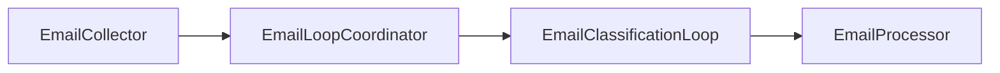

# Email Janitor

Agentic solution that cleans up your email inbox.

## Description

Email Janitor is an agentic pipeline that collects unread emails from your Gmail inbox, classifies each message (ACTIONABLE, INFORMATIONAL, PROMOTIONAL, or NOISE) using an LLM classifier with an optional critic for review and refinement, then applies Gmail labels and archives messages accordingly. Processed messages are tagged with `EmailJanitor-Processed` so they are skipped on subsequent runs.

The app runs in a loop (e.g. every 10 seconds), processing new unread mail each cycle. It uses [Google ADK](https://github.com/google/adk) with [LiteLLM](https://docs.litellm.ai/) (Ollama by default) for local, privacy-preserving classification.

## Features

- **Gmail inbox collection** — Unread messages from inbox only; excludes sent mail and already-processed messages.
- **LLM classification with critic review** — Classifier plus critic agent; low-confidence classifications can be refined or escalated.
- **Configurable thresholds** — Confidence threshold, max refinements, and classifier/critic consensus weights via env.
- **Label-based organization** — Applies category labels and `EmailJanitor-Processed`; can archive by removing INBOX.
- **Docker / Docker Compose** — Run via Compose with mounted Gmail credentials.

## Prerequisites

- **Python** ≥ 3.12
- **Ollama** with `llama3.1:8b` and `mistral-nemo:latest` (or pull equivalent models used by the classifier/critic)
- **Gmail API** — OAuth client credentials, `client_secret.json`, and `gmail_token.json` (from the [simplegmail](https://github.com/jeremyephron/simplegmail) OAuth flow)
- **Environment** — `.env` supported via `python-dotenv` (see [Configuration](#configuration))

## Installation

Clone the repository, then install dependencies with [uv](https://docs.astral.sh/uv/):

```bash
uv sync
```

Alternatively, use pip:

```bash
pip install -e .
```

## Configuration

### Gmail

Place `client_secret.json` and `gmail_token.json` in the project root (or wherever the app and [Gmail client](email_janitor/tools/gmail_client.py) expect them). For Docker, mount these into the container (see [Usage](#docker)).

### Models

The app uses LiteLLM with Ollama. The classifier and critic models are set in the [classification coordinator](email_janitor/sub_agents/classification_coordinator.py) (e.g. `ollama_chat/llama3.1:8b`, `ollama_chat/mistral-nemo:latest`). You can switch to other LiteLLM-backed providers (e.g. OpenAI) by changing those model IDs and setting the appropriate API keys.

### Classification

[`ClassificationConfig`](email_janitor/config.py) reads from environment variables with the `CLASSIFICATION_` prefix:

| Variable                              | Description                              | Default      |
| ------------------------------------- | ---------------------------------------- | ------------ |
| `CLASSIFICATION_CONFIDENCE_THRESHOLD` | Confidence above which critic is skipped | `0.95`       |
| `CLASSIFICATION_MAX_REFINEMENTS`      | Max refinement iterations                | `1`          |
| `CLASSIFICATION_CLASSIFIER_WEIGHT`    | Classifier weight in consensus           | `0.6`        |
| `CLASSIFICATION_CRITIC_WEIGHT`        | Critic weight in consensus               | `0.4`        |
| `CLASSIFICATION_ESCALATION_CATEGORY`  | Category when max refinements reached    | `ACTIONABLE` |

See [`.env.example`](.env.example) for a template. Copy to `.env` and adjust as needed.

## Usage

### Local

From the project root:

```bash
uv run python -m email_janitor.main
```

Or, with the venv activated:

```bash
python -m email_janitor.main
```

The agent runs in a loop (default 10 seconds between runs). Press `Ctrl+C` to stop.

### Docker

Build and run with Docker Compose:

```bash
docker compose up
```

Ensure `client_secret.json` and `gmail_token.json` exist in the project root. They are mounted into the container per [compose.yml](compose.yml). `GOOGLE_APPLICATION_CREDENTIALS` is set to `/app/client_secret.json` for the Gmail service.

## Architecture

The root agent is a **sequential pipeline**:

1. **EmailCollector** — Fetches unread emails from Gmail (inbox, excluding sent and already processed).
2. **EmailLoopCoordinator** — Initializes shared state for the classification loop.
3. **EmailClassificationLoop** — Loop agent that classifies emails one-by-one using a **ClassificationCoordinator** (classifier + critic, with optional refinement).
4. **EmailProcessor** — Applies labels and archiving based on the classification results.



See [agent.py](email_janitor/agent.py) for the agent graph and [docs/design/email_processor_flow.excalidraw](docs/design/email_processor_flow.excalidraw) for the design sketch.

## Development

- **Lint:** `ruff check .`
- **Tests:** `pytest`
- **Editable install:** `uv sync` (or `pip install -e .`)

## License

MIT. See [LICENSE](LICENSE) for details.

## Troubleshooting

- **Gmail OAuth:** Ensure `client_secret.json` and `gmail_token.json` are valid and not expired. Re-run the simplegmail OAuth flow if needed.
- **Ollama:** Confirm Ollama is running and `llama3.1:8b` and `mistral-nemo:latest` are available (`ollama pull ...`).
- **Labels:** The app creates Gmail labels (e.g. `EmailJanitor-Processed`, category labels) if they do not exist; ensure the Gmail account has permission to manage labels.
