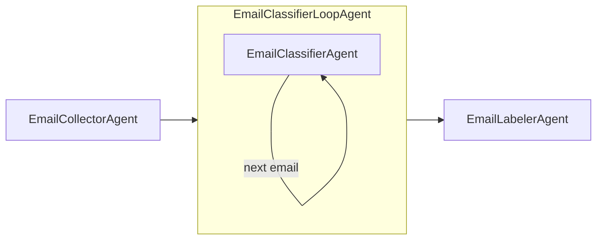

# Email Janitor

Agentic solution that cleans up your email inbox.

## Description

Email Janitor is an agentic pipeline that collects unread emails from your Gmail inbox, classifies each message (URGENT, PERSONAL, INFORMATIONAL, PROMOTIONAL, or NOISE) using an LLM classifier, then applies Gmail labels and archives messages accordingly. Processed messages are tagged with `janitor/done` so they are skipped on subsequent runs.

The app runs in a loop (e.g. every 10 seconds), processing new unread mail each cycle. It uses [Google ADK](https://github.com/google/adk) with [LiteLLM](https://docs.litellm.ai/) (Ollama by default) for local, privacy-preserving classification.

## Features

- **Gmail inbox collection** — Unread messages from inbox only; excludes sent mail and already-processed messages.
- **LLM classification** — Per-email classification using a configurable LiteLLM-backed model.
- **Prompt-injection defenses** — Email content is wrapped in `<untrusted_email>` tags with an explicit trust-boundary directive; HTML bodies are stripped to plain text before reaching the model.
- **Low-confidence review routing** — Classifications below `EMAIL_CLASSIFIER_CONFIDENCE_THRESHOLD` get a `janitor/review` label, stay in the inbox, and are flagged `status=needs_review` for review in the Streamlit UI.
- **Nested Gmail labels** — Applies `janitor/*` category labels and archives non-actionable mail.
- **Run auditing + corrections UI** — SQLite database records every run and per-email classification; a Streamlit app (`make corrections`) surfaces them for review and captures human corrections that feed back into the classifier as few-shot examples.
- **Offline eval harness** — `uv run python -m email_janitor.eval` scores the classifier against a golden JSONL dataset (precision/recall/F1 per category, confusion matrix, confidence calibration).
- **Observability** — Structured JSON logs and optional OpenTelemetry tracing with span attributes for per-email classification work.
- **Resilience** — Transient Gmail errors (429/5xx, connection failures) and LLM timeouts are retried with exponential backoff; the outer poll loop backs off on repeated pipeline errors.
- **Docker / Docker Compose** — Run via Compose with mounted Gmail credentials and a persistent data volume.

## Prerequisites

- **Python** ≥ 3.12
- **Ollama** with `llama3.1:8b` pulled, or another [LiteLLM](https://docs.litellm.ai/)-compatible provider
- **Gmail API** — OAuth client credentials (`client_secret.json` and `gmail_token.json`) via the [simplegmail](https://github.com/jeremyephron/simplegmail) OAuth flow
- **Environment** — `.env` supported via `python-dotenv` (see [Configuration](#configuration))

## Installation

Clone the repository, then install dependencies with [uv](https://docs.astral.sh/uv/):

```bash
make install
# or: uv sync --group dev
```

## Configuration

All configuration is optional — defaults are production-ready for Ollama.

### Gmail credentials

Place `client_secret.json` and `gmail_token.json` in the project root. For Docker, they are mounted into the container (see [compose.yml](compose.yml)).

Run the auth flow once to generate `gmail_token.json`:

```bash
make auth
```

### Environment variables

Copy `.env.example` to `.env` and adjust as needed.

#### App (`EMAIL_JANITOR_` prefix)

| Variable                    | Description                            | Default              |
| --------------------------- | -------------------------------------- | -------------------- |
| `EMAIL_JANITOR_POLL_INTERVAL` | Seconds between processing runs      | `10`                 |
| `EMAIL_JANITOR_USER_ID`     | User ID for ADK session management     | `email-janitor-user` |
| `EMAIL_JANITOR_APP_NAME`    | Application name passed to ADK runner (must be a valid identifier)  | `EmailJanitor`      |

#### Classifier (`EMAIL_CLASSIFIER_` prefix)

| Variable                                | Description                                                                                                            | Default                    |
| --------------------------------------- | ---------------------------------------------------------------------------------------------------------------------- | -------------------------- |
| `EMAIL_CLASSIFIER_MODEL`                | LiteLLM model ID                                                                                                       | `ollama_chat/llama3.1:8b`  |
| `EMAIL_CLASSIFIER_CONFIDENCE_THRESHOLD` | Minimum confidence to trust a classification (1–5). Below this, emails are routed to the review label instead of archived. | `4.0`                  |
| `EMAIL_CLASSIFIER_LLM_TIMEOUT_SECONDS`  | Hard per-call LLM timeout. Exceeding it counts as a retryable failure.                                                 | `30.0`                     |
| `EMAIL_CLASSIFIER_LLM_NUM_RETRIES`      | LiteLLM's built-in retry count for transient LLM errors (timeouts, 5xx, connection).                                   | `3`                        |

#### Gmail (`GMAIL_` prefix)

| Variable                    | Description                                    | Default                |
| --------------------------- | ---------------------------------------------- | ---------------------- |
| `GMAIL_PROCESSED_LABEL`     | Label applied to every processed email         | `janitor/done`         |
| `GMAIL_URGENT_LABEL`        | Label applied to URGENT emails (kept in inbox) | `janitor/urgent`       |
| `GMAIL_PERSONAL_LABEL`      | Label applied to PERSONAL emails (kept in inbox)| `janitor/personal`    |
| `GMAIL_NOISE_LABEL`         | Label applied to NOISE emails                  | `janitor/noise`        |
| `GMAIL_PROMOTIONAL_LABEL`   | Label applied to PROMOTIONAL emails            | `janitor/promotions`   |
| `GMAIL_INFORMATIONAL_LABEL` | Label applied to INFORMATIONAL emails          | `janitor/newsletters`  |
| `GMAIL_REVIEW_LABEL`        | Label applied to low-confidence classifications (kept in inbox) | `janitor/review`  |
| `GMAIL_INBOX_QUERY`         | Base Gmail search query for fetching emails    | `in:inbox -in:sent`    |

Labels are created automatically if they don't exist. The `janitor/*` hierarchy appears as a collapsible `janitor` parent in the Gmail sidebar.

#### Database (`DATABASE_` prefix)

| Variable        | Description                  | Default              |
| --------------- | ---------------------------- | -------------------- |
| `DATABASE_PATH` | Path to the SQLite database file | `email_janitor.db` |

In Docker, this is set to `/data/email_janitor.db` and backed by a named volume (see [compose.yml](compose.yml)).

#### Observability

| Variable      | Description                                                                  | Default |
| ------------- | ---------------------------------------------------------------------------- | ------- |
| `LOG_LEVEL`   | Root log level (`DEBUG`, `INFO`, `WARNING`, `ERROR`).                        | `INFO`  |
| `OTEL_EXPORT` | OpenTelemetry span exporter: `off`, `console` (stdout), or `otlp` (gRPC).    | `off`   |

`OTEL_EXPORT=otlp` requires the `opentelemetry-exporter-otlp` package to be installed separately and standard OTLP env vars (`OTEL_EXPORTER_OTLP_ENDPOINT`, etc.) to be set.

## Usage

### Local

```bash
make run
# or: uv run email-janitor
```

The agent runs in a loop (default 10 seconds between runs). Press `Ctrl+C` to stop.

### Docker

Build and run with Docker Compose:

```bash
docker compose up
```

Or build the image directly:

```bash
make docker-build                                        # image=email-janitor:latest
make docker-build IMAGE=ghcr.io/you/email-janitor TAG=1.0.0
```

Push to a registry:

```bash
make docker-push IMAGE=ghcr.io/you/email-janitor TAG=1.0.0
```

## Architecture

The root agent is a **SequentialAgent** pipeline:

1. **EmailCollectorAgent** — Fetches unread emails from Gmail (inbox, excluding sent and already processed). Stores results in session state and agent state.
2. **EmailClassifierLoopAgent** — A `LoopAgent` that classifies emails one-by-one. On each iteration, `EmailClassifierAgent`:
   - Checks whether all emails have been classified; escalates to end the loop if so.
   - Delegates to a pre-built `LlmAgent` sub-agent with a dynamic per-email prompt.
   - Accumulates results into session state.
3. **EmailLabelerAgent** — Reads all accumulated classifications and applies Gmail labels:
   - `URGENT` → `janitor/urgent`, kept in inbox
   - `PERSONAL` → `janitor/personal`, kept in inbox
   - `INFORMATIONAL` → `janitor/newsletters`, archived
   - `PROMOTIONAL` → `janitor/promotions`, archived
   - `NOISE` → `janitor/noise`, archived
   - Confidence below `EMAIL_CLASSIFIER_CONFIDENCE_THRESHOLD` → `janitor/review`, kept in inbox, `status=needs_review` in DB (regardless of predicted category).
   - All emails receive `janitor/done` to prevent reprocessing.
   - Persists run metadata and per-email classifications to SQLite.


```mermaid
flowchart LR
    A[EmailCollectorAgent] --> Loop
    Loop --> C[EmailLabelerAgent]
    subgraph Loop[EmailClassifierLoopAgent]
        D[EmailClassifierAgent] -->|next email| D
    end
```

Configuration lives in [`src/email_janitor/config/`](src/email_janitor/config/) as Pydantic Settings classes. Agents are defined in [`src/email_janitor/agents/`](src/email_janitor/agents/) and created via factory functions. The database layer lives in [`src/email_janitor/database/`](src/email_janitor/database/).

### Database

Each pipeline run is recorded in a local SQLite database (`email_janitor.db` by default) using [aiosqlite](https://github.com/omnilib/aiosqlite) for non-blocking writes. Three tables are created automatically:

| Table             | Purpose                                                    |
| ----------------- | ---------------------------------------------------------- |
| `runs`            | One row per pipeline run (timing, counts, status)          |
| `classifications` | One row per email processed (classification, reasoning, confidence) |
| `corrections`     | User-submitted corrections used as few-shot examples       |

Browse the data with [sqlite-utils](https://sqlite-utils.datasette.io/):

```bash
sqlite-utils tables email_janitor.db
sqlite-utils rows email_janitor.db runs
sqlite-utils rows email_janitor.db classifications --limit 10
```

## Corrections UI

A Streamlit app surfaces classifications from the database for human review and captures corrections. Corrections are injected into the classifier prompt as few-shot examples on subsequent runs, so fixing a misclassification once improves future runs.

```bash
make corrections
# or: uv run streamlit run src/email_janitor/corrections/app.py
```

Filters in the sidebar: run selector, category, max confidence, "Hide already corrected", and "Needs review only" (shows only low-confidence classifications flagged `status=needs_review`).

In Docker, the UI runs as a separate `corrections` service (port 8501) sharing the same SQLite volume.

## Evaluation

An offline harness scores the classifier against a labeled JSONL dataset. Use it to establish a baseline before tweaking the prompt or swapping models, then re-run to measure the delta.

```bash
# Seed the dataset from the corrections table (handcrafted cases are preserved)
uv run python -m email_janitor.eval.seed_golden --db email_janitor.db

# Run the eval (requires Ollama reachable at the configured endpoint)
uv run python -m email_janitor.eval \
  --dataset tests/eval/golden_emails.jsonl \
  --report-json /tmp/eval.json \
  --progress
```

Output includes per-category precision/recall/F1, a confusion matrix, and a bucketed confidence calibration table. Pass `--no-few-shot` to disable correction injection (useful for clean baselines) or `--limit N` for quick smoke checks.

The dataset at `tests/eval/golden_emails.jsonl` ships with handcrafted sanity cases and adversarial cases covering prompt injection, instruction-bearing subjects, fake JSON payloads, spoofed senders, and HTML-only bodies. Correction-seeded cases are automatically excluded from their own few-shot pool to prevent data leakage during scoring.

## Observability

Logs are emitted as one JSON object per line on stdout. Every line carries at least `ts`, `level`, `logger`, and `msg`, plus any context the call site attached (`run_id`, `email_id`, `category`, `confidence`, etc.). Filter with `jq`:

```bash
uv run email-janitor 2>&1 | jq 'select(.msg == "email_classified")'
```

Set `OTEL_EXPORT=console` to also emit OpenTelemetry spans to stdout. Google ADK emits its own `invoke_agent` and `call_llm` spans automatically once a tracer provider is configured; the classifier additionally wraps per-email work in a `classify_email` span with `email.id`, `predicted_category`, `confidence`, and `parse_failed` attributes.

For production, set `OTEL_EXPORT=otlp` and point the standard OTLP environment variables at your collector.

## Development

```bash
make lint         # ruff check
make format       # ruff format
make test         # pytest
make corrections  # launch the Streamlit corrections UI
make eval         # run the classifier eval harness (requires Ollama)
make eval-seed    # rebuild tests/eval/golden_emails.jsonl from corrections
make clean        # remove .venv, caches
```

## Troubleshooting

- **Gmail OAuth:** Ensure `client_secret.json` and `gmail_token.json` are valid and not expired. Re-run `make auth` if needed.
- **Ollama:** Confirm Ollama is running and the model is available (`ollama pull llama3.1:8b`). If classification consistently times out, raise `EMAIL_CLASSIFIER_LLM_TIMEOUT_SECONDS`.
- **Labels:** Labels are created automatically; ensure the Gmail account has permission to manage labels.
- **Everything in `janitor/review`:** `EMAIL_CLASSIFIER_CONFIDENCE_THRESHOLD` is too high for your model; lower it, or iterate on the prompt with the eval harness.
- **Transient 429 / connection errors:** Gmail calls auto-retry three times with exponential backoff. Repeated failures back off the outer poll loop — watch `consecutive_failures` in the logs.
- **Debugging a misclassification:** Grep the JSON logs for the email's `email_id`, or set `OTEL_EXPORT=console` to see the full span tree including the LLM request/response.

## License

MIT. See [LICENSE](LICENSE) for details.
